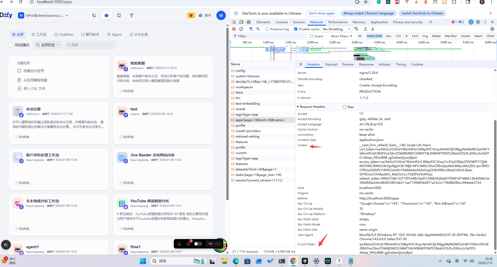
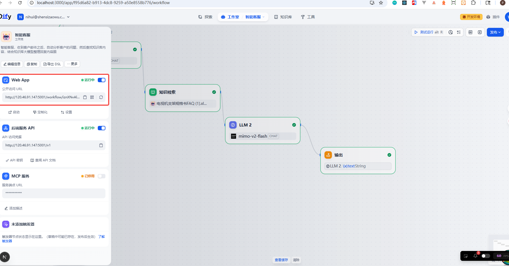
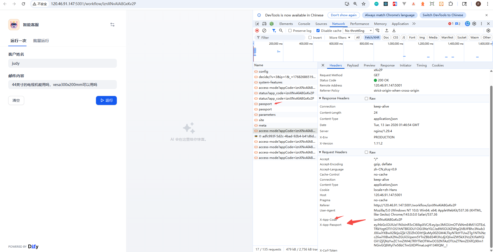
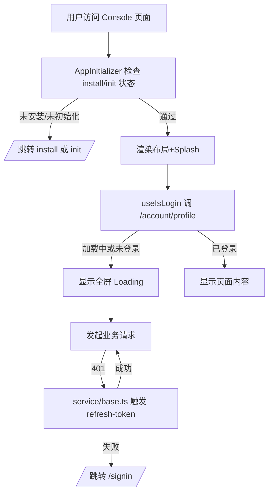
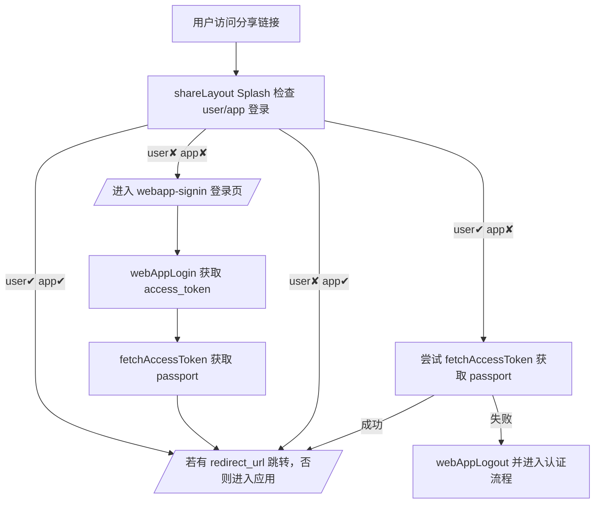
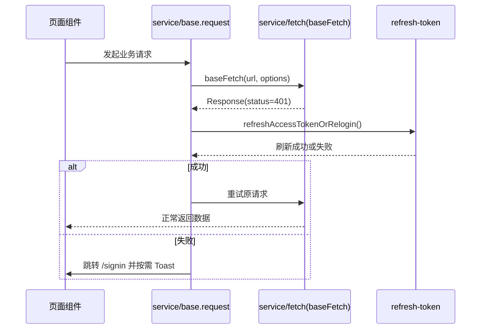

# Dify Web 前端登录与鉴权流程（web）

本文档系统性梳理 Console（控制台）与 WebApp（分享/嵌入式）两种形态下的登录、鉴权、路由守卫与错误处理逻辑。包含代码位置、关键调用链、流程图与时序说明，方便快速定位问题与扩展实现。

---

## 1. 总览与入口
- 根布局加载顺序与全局初始化：[layout.tsx](../app/layout.tsx)
- Console 通用布局加载器（包含登录检测与守卫）：[(commonLayout)/layout.tsx](../app/(commonLayout)/layout.tsx)
- Console 顶层初始化组件（安装/初始化检查与登录跳转）：[app-initializer.tsx](../app/components/app-initializer.tsx)
- 顶层 Splash（遮挡未登录或登录检查中的 UI）：[splash.tsx](../app/components/splash.tsx)
- 登录页入口：[signin/page.tsx](../app/signin/page.tsx)
- 登录表单（邮箱+密码）：[mail-and-password-auth.tsx](../app/signin/components/mail-and-password-auth.tsx)
- 请求封装与鉴权基础设施：
  - Fetch 客户端与钩子：[service/fetch.ts](../service/fetch.ts)
  - 通用请求与 401/403 处理：[service/base.ts](../service/base.ts)
  - 刷新令牌逻辑（避免循环刷新）：[service/refresh-token.ts](../service/refresh-token.ts)
  - 登录 API 入口：[service/common.ts](../service/common.ts)
- Next.js 中间件（CSP/X-Frame-Options）：[middleware.ts](../middleware.ts)

WebApp（分享/嵌入式）额外入口：
- WebApp 鉴权 Splash（AccessToken/Passport 联动）：[(shareLayout)/components/splash.tsx](../app/(shareLayout)/components/splash.tsx)
- WebApp 登录页与布局守卫：[(shareLayout)/components/authenticated-layout.tsx](../app/(shareLayout)/components/authenticated-layout.tsx)、[(shareLayout)/webapp-signin/...](../app/(shareLayout)/webapp-signin/components/mail-and-password-auth.tsx)
- WebApp AccessToken/Passport 管理：[service/webapp-auth.ts](../service/webapp-auth.ts)

### 1.1 接口前缀与鉴权分类
Web 前端对后端请求按“接口前缀”区分为三类，均从 [config/index.ts](../config/index.ts) 导出：

- 需要“登录态/访问凭据”鉴权的主要是两类：`API_PREFIX`（Console）与 `PUBLIC_API_PREFIX`（WebApp）；`MARKETPLACE_API_PREFIX` 通常不需要登录鉴权。
- `API_PREFIX`：Console（控制台）通用管理后台接口地址（默认 `http://localhost:5001/console/api`）
  - 主要依赖 Cookie 会话，默认 `credentials: 'include'`
  - 请求层会自动附带 CSRF Header（从 Cookie 读取）：[service/fetch.ts](../service/fetch.ts)
  - 401 时由 `service/base.ts` 触发刷新令牌，失败则跳转 `/signin`：[service/base.ts](../service/base.ts)
- `PUBLIC_API_PREFIX`：WebApp（分享/嵌入式）公开 API 通道（默认 `http://localhost:5001/api`）
  - 分享入口常见于应用面板的二维码/分享链接组件：[app-card.tsx](../app/components/app/overview/app-card.tsx)
  - WebApp 相关页面与守卫逻辑主要集中在 `app/(shareLayout)` 下（例如登录页、Splash、AuthenticatedLayout）。
  - 请求层会在 Public API 模式自动附带 WebApp 所需鉴权头（由 `beforeRequestPublicWithCode` 注入）：
    - `Authorization: Bearer <access_token>`（来自 `localStorage` 的 WebApp access token；不存在则移除该头）
    - `X-Dify-Share-Code`（分享码）与 `X-Dify-Passport`（应用访问凭据）：[service/fetch.ts](../service/fetch.ts#L73-L106)
- `MARKETPLACE_API_PREFIX`：插件市场接口地址（默认 `http://localhost:5002/api`）
  - 该通道不走 Console/WebApp 登录态，通常不携带 Cookie：Marketplace 请求强制 `credentials: 'omit'`：[service/fetch.ts](../service/fetch.ts)
  - 为兼容不同前端版本，Marketplace 请求会附带 `X-Dify-Version`，后端据此做版本兼容处理：[service/fetch.ts](../service/fetch.ts)
---

主要关于fetch请求以及拦截器的代码在`service/fetch.ts`，关于请求涉及到的第三方库主要有：
1. **js-cookie** https://github.com/js-cookie/js-cookie
2. **ky** https://github.com/sindresorhus/ky
```service/fetch.ts
let base: string
if (isMarketplaceAPI)
  base = MARKETPLACE_API_PREFIX
else if (isPublicAPI)
  base = PUBLIC_API_PREFIX
else
  base = API_PREFIX
```

## 2. Console 登录与守卫流程
 
 如图管理后台的鉴权主要是请求头`Cookie`和`x-csrf-token`组成，`x-csrf-token`的值其实也是从cookie里面取的

### 2.1 顶层初始化与守卫
- Console 布局在渲染主内容前，通过 [AppInitializer](../app/components/app-initializer.tsx) 进行安装/初始化状态与登录态承接：
  - 若系统未安装或未初始化，分别跳转 `/install` 或 `/init`。
  - 若 OAuth 注册新用户场景存在，则清理 UTM 信息并最终进入首页或目标地址。
  - 如出现异常（例如用户未登录），直接跳转至 `/signin`。

示例关键片段（跳转逻辑）：[app-initializer.tsx:L69-L108](../app/components/app-initializer.tsx#L69-L108)

### 2.2 顶层 Splash 组件
- [splash.tsx](../app/components/splash.tsx) 使用 `useIsLogin()` 进行登录态检测：
  - `isLoading` 或 `!isLoggedIn` 时，渲染全屏 Loading 遮罩，避免未授权内容闪现。
  - Splash 本身不直接做跳转；跳转由 AppInitializer 及请求错误处理承担。

登录态检测 Hook：`useIsLogin()` 通过访问 `/account/profile` 判断是否 401（未登录）：[use-common.ts:L209-L233](../service/use-common.ts#L209-L233)

### 2.3 登录页与登录提交
- 登录页入口：[signin/page.tsx](../app/signin/page.tsx)
  - 渲染普通登录表单或“最后一步”页面（OAuth/邀请流程）。
- 邮箱+密码登录表单：[mail-and-password-auth.tsx](../app/signin/components/mail-and-password-auth.tsx)
  - 调用 `login({ url: '/login', body })`：[common.ts:L51-L56](../service/common.ts#L51-L56)
  - 成功后跟踪埋点并根据 `redirect_url` 或默认跳转到 `/apps`：[mail-and-password-auth.tsx:L35-L90](../app/signin/components/mail-and-password-auth.tsx#L35-L90)

### 2.4 请求封装与鉴权钩子
- `service/fetch.ts` 基于 `ky` 定制：
  - 统一 `Content-Type`、超时与基础钩子。
  - `afterResponseErrorCode`：统一处理 403/401（401 交给上层重试/跳转）；错误信息使用 Toast 提示。[fetch.ts:L37-L63](../service/fetch.ts#L37-L63)
  - CSRF 头自动注入（读取 Cookie）：[fetch.ts:L155-L160](../service/fetch.ts#L155-L160)
- `service/base.ts` 封装通用 `request`/`get`/`post`：
  - 收到 401 时：
    - 解析后端返回的错误码，区分 CE/EE 与 WebApp 场景；
    - 触发刷新令牌 `refreshAccessTokenOrRelogin(TIME_OUT)`，成功则重试原请求；
    - 刷新失败则跳转至 `/signin` 并按需提示。[base.ts:L545-L612](../service/base.ts#L545-L612)
- 刷新令牌（避免无限刷新循环）：[refresh-token.ts](../service/refresh-token.ts)
  - 使用 LocalStorage 锁与事件，确保仅一次刷新请求并等待结果。
  - 刷新接口：`POST /refresh-token`，携带 Cookie，成功后继续；401 则失败。

### 2.5 路由守卫与安全中间件
- Next 中间件：[middleware.ts](../middleware.ts)
  - 设置 CSP 白名单与 `X-Frame-Options` 防点击劫持（除聊天/工作流/完成页与 WebApp 登录页允许嵌入）：[middleware.ts:L6-L13](../middleware.ts#L6-L13)
  - 非登录态的实际“守卫”在客户端请求层完成（401→刷新或跳转），中间件不做业务鉴权。

---

## 3. WebApp（分享/嵌入式）登录与守卫流程
 
 如图应用发布之后提供了对外公开的地址，也就是webapp用来运行我们发布的应用。对于绝大部分webapp的接口,都是通过在请求头加上`X-App-Code`、`X-App-Passport`鉴权的，部分对外公开的接口不需要鉴权。
 

WebApp 与 Console 的差异在于：用户登录（`access_token`）与应用访问凭据（`passport`）分离，并通过公开 API 通道（Public API）访问。请求签名与路由跳转也独立。

### 3.1 WebApp Splash（双态登录核验）
- 入口：[app/(shareLayout)/components/splash.tsx](../app/(shareLayout)/components/splash.tsx)
  - 调用 `webAppLoginStatus(shareCode, embeddedUserId?)` 远程校验用户登录与应用登录（app_logged_in）。[webapp-auth.ts:L28-L50](../service/webapp-auth.ts#L28-L50)
  - 四种状态分支：
    1. 用户已登录 & 应用已登录：若存在 `redirect_url`，跳转；否则取消遮挡。
    2. 用户未登录 & 应用未登录：进入认证流程（显示登录 UI）。
    3. 用户未登录 & 应用已登录：直接跳转（passport 可用）。
    4. 用户已登录 & 应用未登录：尝试 `fetchAccessToken(appCode)` 以获取并设置 `passport`，失败则 `webAppLogout` 并进入认证。[splash.tsx:L46-L97](../app/(shareLayout)/components/splash.tsx#L46-L97)

### 3.2 WebApp 登录页与布局守卫
- 登录页（邮箱+密码）：[(shareLayout)/webapp-signin/components/mail-and-password-auth.tsx](../app/(shareLayout)/webapp-signin/components/mail-and-password-auth.tsx)
  - `webAppLogin({ url: '/login', body })` 使用 Public API 通道登录；返回 `access_token` 存储于 LocalStorage。[common.ts:L54-L56](../service/common.ts#L54-L56)
  - 登录成功后拉取应用 `passport` 并设置，然后根据 `redirect_url` 跳转。
- 鉴权外壳与权限检查：[(shareLayout)/components/authenticated-layout.tsx](../app/(shareLayout)/components/authenticated-layout.tsx)
  - 注入 `shareCode` 与 `redirect_url`，不可访问时展示 `AppUnavailable` 并提供返回登录页的入口。

### 3.3 Public API 请求签名
- Public API 的 `beforeRequest` 钩子在请求头自动附加：
  - `Authorization: Bearer <access_token>`
  - `X-Dify-Share-Code`（`WEB_APP_SHARE_CODE_HEADER_NAME`）与 `X-Dify-Passport`（`PASSPORT_HEADER_NAME`）——由 URL 推断或缓存获得。[fetch.ts:L95-L106](../service/fetch.ts#L95-L106)
- `resolveShareCode()` 智能从路径或 `redirect_url` 推断分享码，避免登录页/校验页误判：[fetch.ts:L73-L93](../service/fetch.ts#L73-L93)
- Public API 的 401/403 在 `service/base.ts` 中按 WebApp 码流处理（多种错误码分支），必要时引导到 WebApp 登录页面。

---

## 4. 错误处理与边界情况

- 401（未登录）：
  - Console：优先刷新令牌；失败跳转 `/signin`。[base.ts:L598-L612](../service/base.ts#L598-L612)
  - WebApp：依据错误码（`web_app_access_denied`/`web_sso_auth_required`/`unauthorized`）分别引导到 WebApp 登录或 SSO。[base.ts:L572-L585](../service/base.ts#L572-L585)
- 403（禁止访问）：
  - 统一 Toast 提示；特定码 `already_setup` 跳转 `/signin`。[fetch.ts:L43-L50](../service/fetch.ts#L43-L50)
- CSRF：
  - Console 与 Marketplace：自动从 Cookie 注入 CSRF 头；Public API 不注入（外部访问场景）。[fetch.ts:L155-L165](../service/fetch.ts#L155-L165)
- 刷新令牌并发安全：
  - LocalStorage 锁与事件避免多个标签页并发刷新导致循环；刷新失败时中止重试链路。[refresh-token.ts](../service/refresh-token.ts)

---

## 5. 流程图与时序

### 5.1 Console 登录流程图



### 5.2 WebApp 登录流程图



### 5.3 Console 请求 401 时序示意



---

## 6. 关键代码索引
- 布局与初始化：
  - [layout.tsx](../app/layout.tsx)
  - [(commonLayout)/layout.tsx](../app/(commonLayout)/layout.tsx)
  - [app-initializer.tsx](../app/components/app-initializer.tsx)
- 登录页与表单：
  - [signin/page.tsx](../app/signin/page.tsx)
  - [mail-and-password-auth.tsx](../app/signin/components/mail-and-password-auth.tsx)
- WebApp：
  - [(shareLayout)/components/splash.tsx](../app/(shareLayout)/components/splash.tsx)
  - [(shareLayout)/components/authenticated-layout.tsx](../app/(shareLayout)/components/authenticated-layout.tsx)
  - [(shareLayout)/webapp-signin/components/mail-and-password-auth.tsx](../app/(shareLayout)/webapp-signin/components/mail-and-password-auth.tsx)
  - [service/webapp-auth.ts](../service/webapp-auth.ts)
- 鉴权与请求：
  - [service/fetch.ts](../service/fetch.ts)
  - [service/base.ts](../service/base.ts)
  - [service/refresh-token.ts](../service/refresh-token.ts)
- 其他：
  - [middleware.ts](../middleware.ts)
  - [useIsLogin](../service/use-common.ts#L209-L233)

---
