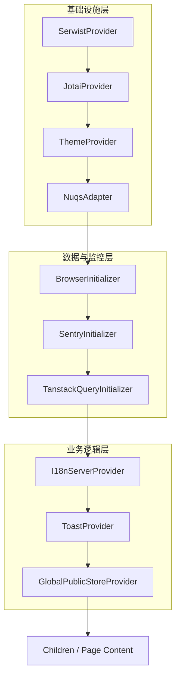

# 入口文件layout解析
根布局加载顺序与全局初始化，文件地址[layout.tsx](../app/layout.tsx)

## 代码分析
每个provider的作用都在注释中，这里不再赘述。
```
 <body
    className="color-scheme h-full select-auto"
    {...datasetMap}>
    {/* SerwistProvider 必须在最外层，用于控制整个页面的缓存和离线能 */}
    <SerwistProvider swUrl={swUrl}>
        {/* ReactScanLoader 是一个用于 React 性能调试 的开发者工具加载器。 */}
        <ReactScanLoader />
        {/* JotaiProvider (全局状态管理) : 放在顶层，确保原子状态（Atoms）在应用的任何地方都能被访问和初始化*/}
        <JotaiProvider>
            {/* ThemeProvider (样式/主题) : 负责注入 CSS 变量或类名（如 dark 模式）。后续所有的 UI 组件（包括 Toast、Loading 等）都需要根据它来渲染正确的颜色 */}
            <ThemeProvider
                attribute="data-theme"
                defaultTheme="system"
                enableSystem
                disableTransitionOnChange
                enableColorScheme={false}
            >
                {/* NuqsAdapter : 处理 URL 查询参数的状态，放在高层是为了让后续组件能尽早读取 URL 状态 */}
                <NuqsAdapter>
                    {/* BrowserInitializer 是一个 Polyfill（补丁）和环境兼容层 ，它的主要作用不是渲染 UI，确保在ssr环境中访问localStorage和sessionStorage时不会报错 */}
                    <BrowserInitializer>
                        {/* SentryInitializer : 初始化前端的错误监控与性能追踪服务 。它使用了 Sentry 这个知名的监控平台 SDK。开发环境下不启动；线上收集错误 */}
                        <SentryInitializer>
                            {/* TanstackQueryInitializer React Query (TanStack Query) 的初始化器 它创建并提供了一个全局的 QueryClient 实例，负责管理应用中所有的 服务端状态（Server State） */}
                            <TanstackQueryInitializer>
                                {/* I18nServerProvider : 提供应用的国际化支持。它使用了 i18next 这个库，负责加载和管理应用的翻译资源 。国际化（多语言） 的服务端入口 负责在 服务端渲染 (SSR) 阶段就确定当前用户的语言，并加载对应的翻译资源包*/}
                                <I18nServerProvider>
                                    {/* ToastProvider : 提供应用的通知功能。它使用了 react-toastify 这个库，负责在应用中显示 Toast 消息（如成功、错误、警告等） */}
                                    <ToastProvider>
                                        {/* GlobalPublicStoreProvider :它会在应用启动时立即请求后端接口（通常是 /system-features ），获取全局配置信息。 */}
                                        <GlobalPublicStoreProvider>
                                        {children}
                                        </GlobalPublicStoreProvider>
                                    </ToastProvider>
                                </I18nServerProvider>
                            </TanstackQueryInitializer>
                        </SentryInitializer>
                    </BrowserInitializer>
                </NuqsAdapter>
            </ThemeProvider>
        </JotaiProvider>
        <RoutePrefixHandle />
    </SerwistProvider>
</body>
```
## 需要关注的Provider
我们只需要着重关注以下几个Provider，其他的都是关于开发环境下或者错误追踪的。
- JotaiProvider : 全局状态管理,整个暂时也不需要关注，只用在i18n功能中使用了，也是状态管理的一种方式。
- TanstackQueryInitializer : React Query (TanStack Query) 的初始化器 它创建并提供了一个全局的 QueryClient 实例，负责管理应用中所有的 服务端状态（Server State）
- I18nServerProvider : 提供应用的国际化支持。它使用了 i18next 这个库，负责加载和管理应用的翻译资源 。国际化（多语言） 的服务端入口 负责在 服务端渲染 (SSR) 阶段就确定当前用户的语言，并加载对应的翻译资源包
- ToastProvider : 提供应用的通知功能。它使用了 react-toastify 这个库，负责在应用中显示 Toast 消息（如成功、错误、警告等）
- GlobalPublicStoreProvider :它会在应用启动时立即请求后端接口（通常是 /system-features ），获取全局配置信息。
  
