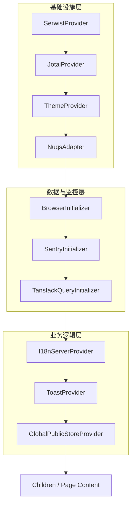

# 入口文件layout解析
根布局加载顺序与全局初始化，文件地址[layout.tsx](../app/layout.tsx)

## 代码分析
    
```tsx
      <body
        className="color-scheme h-full select-auto"
        {...datasetMap}
      >
        <SerwistProvider swUrl={swUrl}>
          <ReactScanLoader />
          <JotaiProvider>
            <ThemeProvider
              attribute="data-theme"
              defaultTheme="system"
              enableSystem
              disableTransitionOnChange
              enableColorScheme={false}
            >
              <NuqsAdapter>
                <BrowserInitializer>
                  <SentryInitializer>
                    <TanstackQueryInitializer>
                      <I18nServerProvider>
                        <ToastProvider>
                          <GlobalPublicStoreProvider>
                            {children}
                          </GlobalPublicStoreProvider>
                        </ToastProvider>
                      </I18nServerProvider>
                    </TanstackQueryInitializer>
                  </SentryInitializer>
                </BrowserInitializer>
              </NuqsAdapter>
            </ThemeProvider>
          </JotaiProvider>
          <RoutePrefixHandle />
        </SerwistProvider>
      </body>
```

## 核心 Provider 功能解析

以下是 `layout.tsx` 中使用的所有 Provider 的详细功能列表。

### ⚠️ 核心业务组件 (重点关注)

这些组件直接支撑业务逻辑，开发过程中会高频交互。

*   **`TanstackQueryInitializer`**
    *   **作用**: 初始化 **React Query** 客户端。
    *   **功能**: 负责管理所有**服务端状态 (Server State)**，包括 API 数据请求、缓存、自动重试和过期管理。代码中所有的 `useQuery` 和 `useMutation` 都依赖它。
*   **`GlobalPublicStoreProvider`**
    *   **作用**: 加载**应用级公共配置**。
    *   **功能**: 在应用启动时立即请求后端 `/system-features` 接口，获取全局开关（如内容审查、未登录访问权限）和配置。在该数据加载完成前，它会展示全屏 Loading，阻止业务页面渲染。
*   **`I18nServerProvider`**
    *   **作用**: **国际化 (i18n)** 服务端入口。
    *   **功能**: 在服务端渲染 (SSR) 阶段确定用户语言，并注入对应的 JSON 翻译资源包，防止页面“闪烁”。
*   **`ToastProvider`**
    *   **作用**: **全局消息提示**容器。
    *   **功能**: 提供 `notify()` 方法，用于在页面右上角弹出成功、错误或警告提示框。

### 🛠️ 基础设施与工具 (了解即可)

这些组件主要负责底层运行环境或开发辅助，通常不需要修改。

*   **`SerwistProvider`**
    *   **作用**: **PWA (Service Worker)** 支持。
    *   **功能**: 注册 Service Worker，实现离线缓存、资源预加载，提升应用在弱网环境下的加载速度。
*   **`JotaiProvider`**
    *   **作用**: **原子化状态管理** (Jotai) 根节点。
    *   **功能**: 提供全局状态上下文。目前项目中主要用于管理一些轻量级的客户端 UI 状态。
*   **`ThemeProvider`**
    *   **作用**: **样式与主题**管理。
    *   **功能**: 注入 CSS 变量，支持亮色/暗色模式切换 (Dark Mode)。
*   **`NuqsAdapter`**
    *   **作用**: **URL 查询参数**适配器。
    *   **功能**: 让组件能更方便地读取和修改 URL 中的 Query String (如 `?page=1&sort=desc`)。
*   **`BrowserInitializer`**
    *   **作用**: **浏览器环境 Polyfill**。
    *   **功能**: 填补旧版浏览器缺失的 JS API (如 `toSpliced`)，并修补 `localStorage` 在隐身模式下的兼容性问题。
*   **`SentryInitializer`**
    *   **作用**: **错误监控** (生产环境)。
    *   **功能**: 自动捕获 JS 报错和性能数据，上传到 Sentry 平台以便排查 Bug。
*   **`ReactScanLoader`**
    *   **作用**: **性能调试工具** (开发环境)。
    *   **功能**: 高亮显示发生重渲染 (Re-render) 的组件，帮助开发者进行性能优化。
*   **`RoutePrefixHandle`**
    *   **作用**: **子路径部署兼容**。
    *   **功能**: 监听 DOM 变化，自动为 `` 标签的 `src` 添加 `basePath` 前缀，确保在非根目录部署时图片能正常显示。

